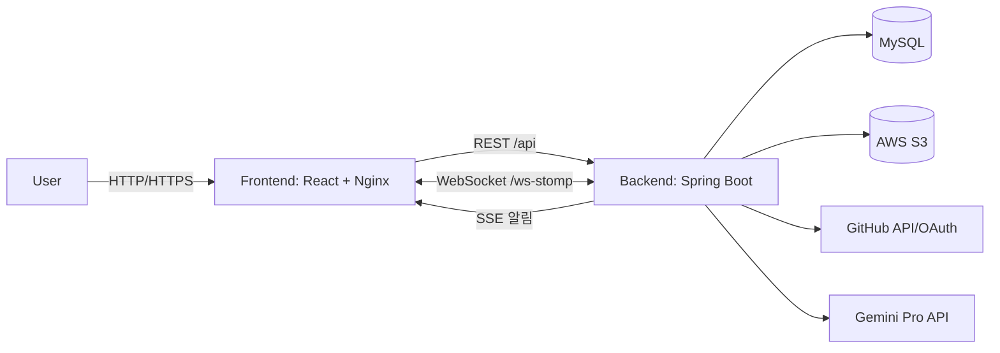

# 🚀 LinkLogMate (LLM)

> **"개발자는 개발에만 집중하세요. 리포트는 AI가 작성합니다."**
> 
> **GitHub 연동으로 시작하고, AI로 완성하는 지능형 올인원 협업 프로젝트 관리 시스템** > 코드(Commit), 이슈(Issue), 업무(Task), 보고서(Report)를 단일 플랫폼에서 관리하며, **AI가 일일 및 최종 보고서를 자동으로 생성**합니다.

[](#)
[](#)
[](#)
[](#)
[](#)

<br/>

## 📖 프로젝트 개요

현대의 개발 환경에서는 **GitHub(코드/이슈)** 와 **관리 도구(Jira/Notion 등)** 가 분리되어 있어 정보가 파편화되고, 개발자는 보고서 작성과 같은 관리 업무에 많은 시간을 소모하게 됩니다. 

**LinkLogMate**는 이러한 문제를 해결하기 위해 기획되었습니다. GitHub 활동 내역을 기반으로 프로젝트 진행 현황을 자동으로 추적하고, **Gemini Pro AI**를 활용해 보고서를 자동 생성함으로써 팀의 생산성을 극대화하는 올인원 협업 플랫폼입니다.

- **개발 기간**: 2026.01.09 ~ 2026.02.09
- **Backend Repository**: [LLMSpring(dev)](https://github.com/sgn08062/LLMSpring)
- **Frontend Repository**: [LLMReact(dev)](https://github.com/sgn08062/LLMReact)

<br/>

## ✨ 핵심 기능 (Key Features)

### 🐙 1. GitHub 연동 & 데이터 자동 동기화
- 프로젝트 생성 시 GitHub Repository 및 Branch 선택 연동
- 커밋(Commit), PR, 이슈 데이터를 실시간 동기화
- 팀원별 커밋 통계를 분석하여 시각화된 기여도 대시보드 제공

### 📊 2. AI 자동 보고서 (Daily / Final)
- **일일 보고서 (Daily Report)**: GitHub 커밋 로그를 분석하여 자동 요약. AI 챗봇을 통한 "문장 다듬기 / 요약 보강 / 회고 질문" 기능 지원.
- **최종 보고서 (Final Report)**: 프로젝트 전체 히스토리(커밋/이슈/리포트)를 종합하여 섹션별 자동 초안 생성.

### 📋 3. 애자일 기반 업무(Task) 및 이슈 관리
- **칸반 보드 (Kanban)**: Todo / In Progress / Done 상태를 Drag & Drop으로 직관적 관리
- **이슈 트래커 (Issue)**: 다양한 조건의 필터링 지원 및 GitHub 커밋(SHA/메시지/URL)과 완벽한 매핑
- Task별 전용 채팅을 통한 문맥(Context) 중심의 커뮤니케이션

### ⚡ 4. 실시간 협업 & 알림 시스템
- **WebSocket (STOMP)** 기반의 지연 없는 실시간 채팅
- **SSE (Server-Sent Events)** 로 초대, 할당, 댓글 등 주요 이벤트 단방향 푸시 알림

### 🔒 5. 철저한 보안 및 권한 관리
- 자체 회원가입 및 GitHub OAuth 연동 로그인
- JWT (Access/Refresh) 기반 인증 아키텍처
- 양방향 암호화 키를 활용한 GitHub 토큰의 안전한 보관

<br/>

## 🏗 시스템 아키텍처 (Architecture)



<br/>

## 🛠 기술 스택 (Tech Stack)

### Frontend
- **Framework & Routing:** React (CRA), react-router-dom
- **Real-time Communication:** SockJS + STOMP (WebSocket)
- **UI & Visualization:** Toast UI Editor, Recharts, framer-motion

### Backend
- **Core:** Java 17, Spring Boot 3
- **Web & Communication:** Spring Web, Spring WebSocket, Spring Boot Actuator
- **Data Access:** Spring Data JPA, MyBatis
- **Security:** Spring Security, OAuth2 Client, JWT, BCrypt
- **Storage:** AWS S3 (spring-cloud-aws)

### Database & Infrastructure
- **RDBMS:** MySQL
- **Infra & DevOps:** Docker, Nginx, AWS ECS

<br/>

## 🚀 빠른 시작 (Quick Start)

### 로컬 실행 (Local Development)

#### 1) Backend (LLMSpring)
```bash
git clone https://github.com/sgn08062/LLMSpring
cd LLMSpring

# (선택) 테스트 제외 빌드
./gradlew clean build -x test

# 서버 실행 (기본 포트: 8080)
./gradlew bootRun
```
> **Note:** 로컬 환경에 MySQL 8.x 버전을 구동해 주시기 바랍니다. (예: `localhost:3306`)

#### 2) Frontend (LLMReact)
```bash
git clone https://github.com/sgn08062/LLMReact
cd LLMReact

# 패키지 설치 및 실행 (기본 포트: 3000)
npm ci
npm start
```
> **CORS 설정 안내:** 현재 프론트엔드의 API 래퍼는 `BASE_URL=""`(동일 Origin) 기준입니다. 로컬에서 실행할 경우 `src/utils/api.js`의 `BASE_URL`을 `http://localhost:8080`으로 변경하거나, `package.json`에 `"proxy": "http://localhost:8080"` 설정을 추가해야 합니다.

### Docker로 실행

LLMReact는 멀티 스테이지 빌드 후 Nginx로 정적 파일을 서빙하며, `/api`, `/ws-stomp`, `/oauth2`, `/login/oauth2` 경로를 백엔드로 프록시합니다.  
따라서 운영 환경에서는 **CORS 이슈 없이 동일 도메인에서** 프론트/백엔드가 동작하도록 구성할 수 있습니다.

#### docker-compose 예시

> ✅ 전제: 같은 상위 폴더에서 `LLMSpring/`과 `LLMReact/`를 각각 클론한 뒤 실행합니다. (compose의 `context:` 경로가 이를 기준으로 작성되어 있습니다.)

> 아래는 **예시**입니다. (서비스명/포트/환경변수는 환경에 맞게 조정하세요.)  
> 특히 Nginx 설정에서 백엔드 호스트를 `backend-container:8080`으로 바라보므로, compose에서 해당 서비스명(또는 network alias)을 맞추는 것을 권장합니다.

```yaml
services:
  backend-container:
    build:
      context: ./LLMSpring
    ports:
      - "8080:8080"
    environment:
      DB_NAME: your_db
      DB_USERNAME: your_user
      DB_PASSWORD: your_pass
      JWT_SECRET_KEY: your_jwt_secret
      TWO_WAY_ENCRYPTION: your_encrypt_key
      GITHUB_CLIENT_ID: your_github_client_id
      GITHUB_CLIENT_SECRET: your_github_client_secret
      GEMINI_API: your_gemini_api_key
      AWS_ACCESS_KEY: your_aws_access_key
      AWS_SECRET_KEY: your_aws_secret_key
      AWS_BUCKET_NAME: your_bucket
      APP_FRONTEND_URL: "http://localhost" # app.frontend.url 매핑
  frontend-container:
    build:
      context: ./LLMReact
    ports:
      - "80:80"
    depends_on:
      - backend-container
```
### 🐳 Docker 환경 실행 가이드

> **사전 확인 사항**
> `docker-compose.yml` 파일의 `context` 경로를 맞추기 위해, 동일한 상위 디렉토리 내에 `LLMSpring/` (백엔드) 및 `LLMReact/` (프론트엔드) 레포지토리가 모두 클론되어 있어야 합니다.

### Backend 필수 환경변수

> 운영 환경(AWS EC2) 배포 및 필수 환경변수 설정에 대한 상세한 가이드는 아래 문서를 참고해 주시기 바랍니다.
> 🔗 **[AWS 배포 및 환경변수 키 발급 방법](https://branch-wildebeest-f8e.notion.site/AWS-EC2-302273564d008040a538d4399a455aea)**
추천 2. 리드미 최하단에 📚 관련 문서 섹션 신설

아래 값들은 `LLMSpring/src/main/resources/application.properties` 에서 참조됩니다.

- `DB_NAME`, `DB_USERNAME`, `DB_PASSWORD`
- `JWT_SECRET_KEY` (Access/Refresh 토큰 서명 키)
- `TWO_WAY_ENCRYPTION` (GitHub 토큰 암호화 키)
- `GITHUB_CLIENT_ID`, `GITHUB_CLIENT_SECRET`
- `GEMINI_API` (Gemini Pro API Key)
- `AWS_ACCESS_KEY`, `AWS_SECRET_KEY`, `AWS_BUCKET_NAME`
- `APP_FRONTEND_URL` → `app.frontend.url` 로 바인딩되어 CORS/리다이렉트에 사용

### GitHub OAuth 설정 체크리스트
- GitHub OAuth App 생성 후 Client ID/Secret 발급
- Callback URL 예시:
  - 로컬: `http://localhost:8080/login/oauth2/code/github`
  - 운영: `https://{your-domain}/login/oauth2/code/github`

### 환경변수/설정

작성이 완료된 `docker-compose.yml` 파일이 위치한 경로에서 터미널을 열고 아래 명령어들을 상황에 맞게 실행해 주십시오.

#### 1. 서비스 실행 및 빌드 (최초 실행 또는 코드 변경 시)
컨테이너를 백그라운드 모드(`-d`)로 실행하며, 이전 캐시를 무시하고 이미지를 새로 빌드(`--build`)하여 최신 상태를 반영합니다.
```bash
docker-compose up -d --build
```

#### 2. 실시간 로그 확인
구동 중인 백엔드 및 프론트엔드 서버의 에러 로그나 API 호출 상태를 실시간으로 모니터링합니다.
```bash
docker-compose logs -f
```
*(로그 모니터링을 종료하려면 터미널에서 `Ctrl + C`를 입력합니다.)*

#### 3. 서비스 중단 및 삭제
실행 중인 컨테이너 인스턴스와 도커 네트워크 환경을 안전하게 종료하고 삭제합니다.
```bash
docker-compose down
```
---

<br/>

## 📡 대표 API 엔드포인트 (API Endpoints)

| 도메인 | HTTP | 엔드포인트 (Endpoint) | 설명 |
|---|---|---|---|
| **Auth** | `POST` | `/api/auth/logIn` | 로그인 (JWT 발급) |
| | `POST` | `/api/auth/reissue` | 토큰 재발급 |
| **Project** | `POST` | `/api/projects` | 신규 프로젝트 생성 |
| | `GET` | `/api/projects/{projectId}/dashboard` | 프로젝트 대시보드 조회 |
| **Issue** | `POST` | `/api/projects/{projectId}/issues` | 이슈 등록 |
| | `PATCH` | `/api/projects/{projectId}/issues/{issueId}` | 이슈 상태/내용 수정 |
| **Report** | `POST` | `/api/projects/{projectId}/today` | 일일 보고서 자동 생성 |
| | `POST` | `/api/projects/{projectId}/final-reports` | 최종 보고서 종합 생성 |

<br/>

## 💡 트러블슈팅 (Troubleshooting)

* **에디터(리포트 작성) 페이지 뒤로가기 시 흰 화면 및 프리징 현상**
  * **원인:** React DOM과 Toast UI Editor 간의 렌더링 충돌(DOM removeChild 에러, NotFoundError)
  * **해결:** 에디터 컴포넌트를 React 상태 관리 영역에서 물리적으로 격리(Isolation)시키고, 컴포넌트 생명주기에 맞춰 메모리를 안전하게 정리하는 로직을 추가하여 해결했습니다.

* **이슈 트래커의 복잡한 다중 필터 조합 쿼리 성능 저하**
  * **원인:** 상태, 우선순위, 담당자 등 수많은 필터 조건으로 인해 Java 로직 내 수십 개의 조건문이 발생하여 유지보수성 및 성능 저하 우려
  * **해결:** MyBatis Dynamic SQL (`<if>`, `<choose>`, `<where>`)을 적극 도입하여, 데이터베이스 단에서 최적화된 단일 동적 쿼리로 유연하게 데이터를 추출하도록 구조를 개편했습니다.

* **실시간 통신 아키텍처 리소스 과점재 문제**
  * **원인:** 채팅과 알림 시스템을 모두 양방향 소켓(WebSocket)으로 처리할 경우 불필요한 서버 리소스 낭비 발생
  * **해결:** 상호작용이 필수적인 '채팅' 기능은 **WebSocket(STOMP)**으로 유지하고, 단순 이벤트 푸시가 목적인 '알림' 기능은 단방향 통신인 **SSE(Server-Sent Events)** 프로토콜로 분리 설계하여 서버 리소스를 획기적으로 최적화했습니다.

<br/>

## 👥 팀원 및 주요 역할 (Team & Roles)

* **강승태**
  * DB 설계 (Task, Daily Report 도메인)
  * WebSocket 통신, Task, DailyReport, Alarm API 개발
* **이건희**
  * DB 설계 (Project, Issue 도메인)
  * Project, Issue, Member, Scheduler, Alarm API 로직 구현
  * GitHub API 연동 및 UI 개발
* **이경훈**
  * DB 설계 (User, Final Report 도메인)
  * Auth(Spring Security/JWT), User, FinalReport, S3 관리 로직 구현
  * Gemini 프롬프트 작성
  * Toast Notification 시스템 및 UI 컴포넌트 구현
  * AWS 인프라 배포 (CI/CD 파이프라인 구축) 및 UI 통합
